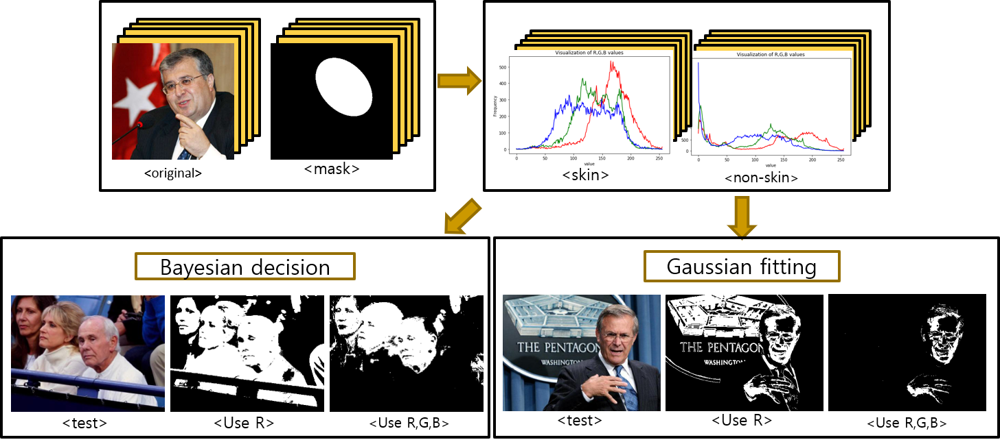
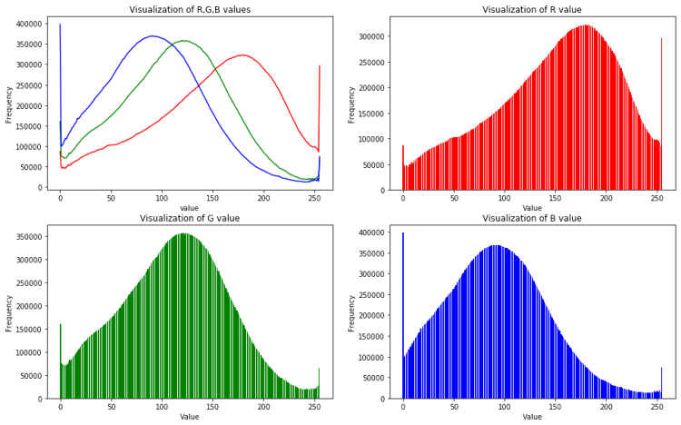
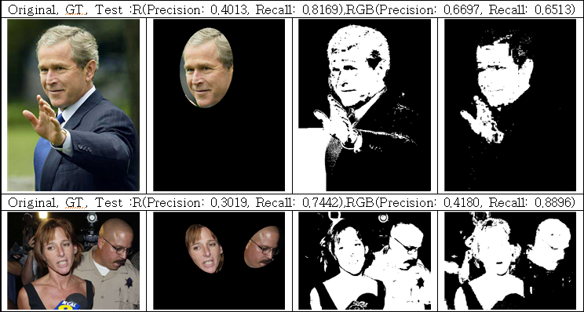
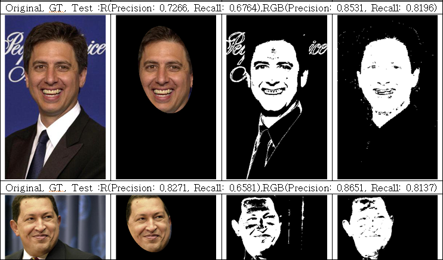
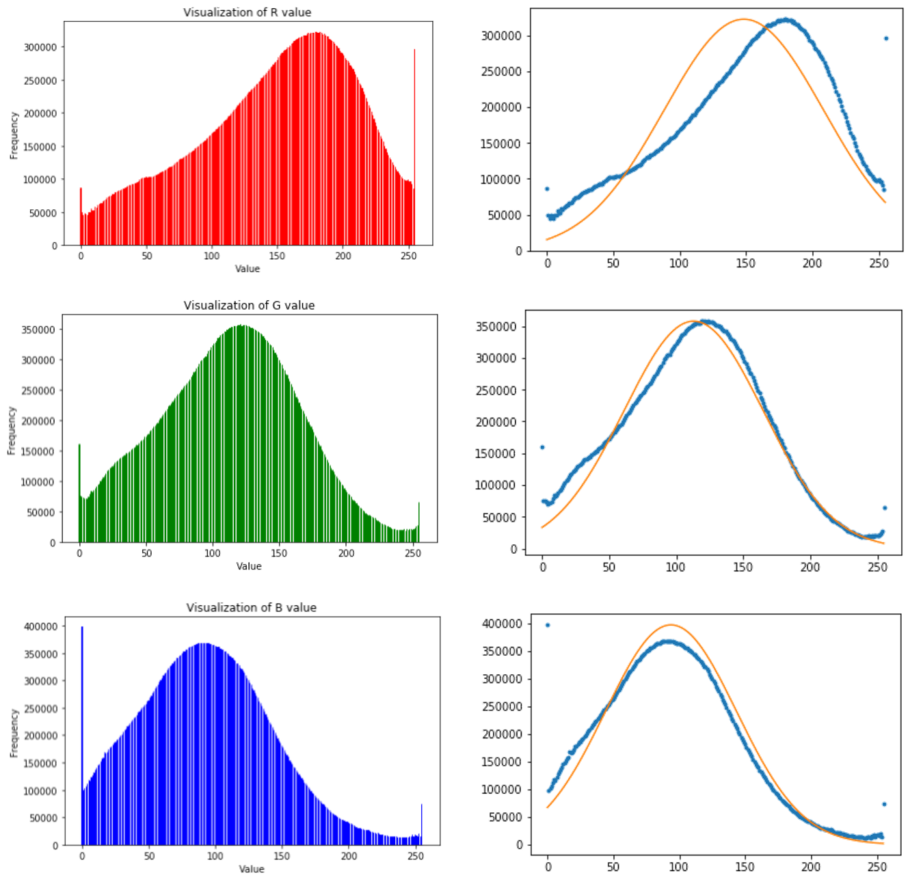
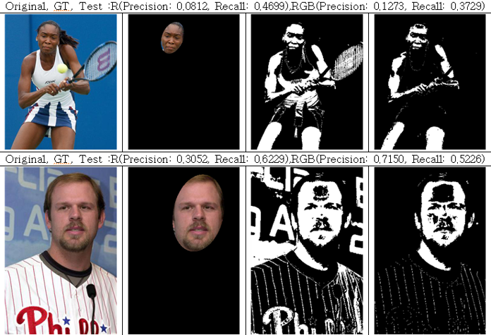
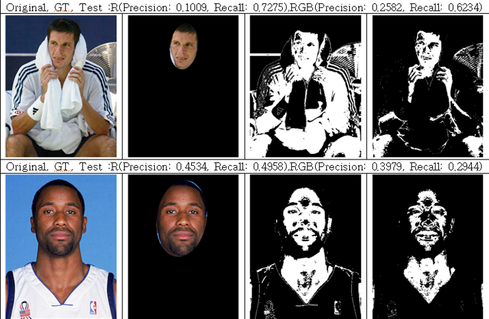

# Skin_detection
Skin detection using Bayesian decision and Gaussian model fitting

## Introduction
The human skin detection is one of the technologies required by computer vision area such as automobile vehicle, face recognition, gesture analysis, semantic segmentation and 3D modeling. This method is for classifying skin and non-skin type. We utilize the Bayesian decision and Gaussian model fitting for solving skin detection problem.

## Bayesian decision results

## Gaussian fitting results

||Precison|Recall||Precison|Recall|
|------|---|---|------|---|---|
|Bayes decision, R, prior|0.268886|0.723119|Bayes decision, RGB, prior|0.454997|0.804442|
|Bayes decision, R, prior=0.5|0.284073|0.643232|Bayes decision, RGB, prior=0.5|0.500974|0.698101|
|Gaussian fitting, R, prior|0.274523|0.545751|Gaussian fitting, RGB, prior|0.262239|0.510497|
|Gaussian fitting, R, prior=0.5|0.431395|0.355402|Gaussian fitting, RGB, prior=0.5|0.376043|0.373039|

## Prerequisites
* Python 3.5
* OpenCV
